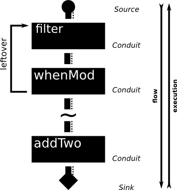

__Every programmer knows the problem about dealing with streaming data with constant memory usage. Thanks to Michael Snoyman there is a handy solution to this problem. Conduits are a way to handle streaming data in a efficent easy event driven way.__

~~~~ {.haskell .numberLines}
import Data.Conduit
import qualified Data.Conduit.List as CL

sink :: Sink String IO ()
sink = CL.mapM putStrLn

source :: Source IO Int
source = CL.sourceList [1..20]

conduit :: Conduit Int IO Int
conduit = do
    first <- await
    second <- await
    case (first,second) of
       (Just f, Just s) -> do
         leftover s 
         yield f*s
         conduit
    
showMe :: Conduit Int IO String
showMe = CL.map show

main :: IO ()
main = source $$ conduit =$= showMe =$ sink
~~~~
##First Look 

The basic implementation can be found in the [conduit](1) package on hackage. There is also a second package [conduit-extra](2) which ships some neat implementation like a attoparsec integration or a simple network interface.

Ok lets introduce us to the basic conduit types. As you can see in the above example conduit is basicly a _monad transformer_. There are four types your should mind of.

To achive a lot of codereuse and simplify the type structure all types like `Sink`, `Source`, `Conduit` are just wrapper around `ConduitM`. This type is the _core monad_ of the conduit package.

`newtype ConduitM i o m r = ConduitM { ... }`


There a lot of free variables. Here the meaning:

- __i__ input type
- __o__ output type
- __m__ monad to transform
- __r__ the return value

All other types wrap `ConduitM`

~~~~ {.haskell}
type Source m o = ConduitM () o m ()

type Sink i = ConduitM i Void

type Conduit i m o = ConduitM i o m ()
~~~~

## What's going on?

This is fine but, how is this surposed to work? First let clearify who the structure of conduit is working. You can imagne a pipe where data comes from the one end, proceeded in the pipe and returned at the other end. Where the data comes in is called `Source`, this data is proceeded by some `Conduits` and maybe printed/send/whatever by the `Sink`.
This means all data from `Source` will be send downstream to the `Sink`.

~~~~ {.haskell}
main = source $$ conduit =$= anotherConduit =$ sink
~~~~
The infix operators called _fuses_.

- `=$`  fuse a `Conduit` and `Sink` together and create a new `Sink`
 
- `$=`  fuse a `Source` and `Conduit` together and create a new `Source`
 
- `=$=` combines two `Conduit` and creates a newone

To connect all together there is the _connector_:

- `$$` connects a `Source` and a `Sink`

By the way you can lookup all operators types here: [conduit on hackage](1)

Now lets create some types. Because all types finally based on `ConduitM` all functions can used in all types.

Basic conduit example:
~~~~
~~~~ {.haskell .numberLines}
import System.IO
import Data.Conduit
import qualified Data.Conduit.List as CL

main = do
    nums <- CL.sourceList [1..10] $= CL.map (*2) =$= CL.map (+1) $$ CL.consume
    putStrLn $ show nums
~~~~

## Core functions. Awaiting data...

To write own conduits there are _three_ core functions you should aware of:

- `await` Pull data from upstream
- `yield d` Put data downstream
- `leftover d` Put data back at the position where it was taken from. Now the next await can consume it.

Example of `await`:

~~~~ {.haskell .numberLines}
import Control.Monad.IO.Class (liftIO)
import System.IO
import Data.Conduit

source :: Source IO String
source = do
    yield "moep"
    yield "hoep"
    yield "floep"
    yield "knoep"

conduit :: Conduit String IO String
conduit = do
    m <- await
    case m of 
      (Just msg) -> isFloep msg >> conduit
      _          -> return ()
    where
      isFloep fl
        | fl == "floep" = yield "I don not like floep" >> conduit
        | otherwise     = yield fl >> conduit
        
sink :: Sink String IO ()
sink = do
    m <- await
    case m of
      (Just msg) -> liftIO (putStrLn m) >> sink
      _          -> return ()
      
main :: IO ()
main = source $= conduit $$ sink
~~~~
Output:

```
»» runhaskell cond1.hs
moep
hoep
I do not like floep
knoep
```

## There is a easier way!


Dealing with `Maybe value` is tedious. The `Data.Conduit.List` module helps out. With the function `awaitForever` you will be able to get around a lot of case statements also no need to think about the recursion of function you are implementeing


 


## There is a easier way!


Dealing with _Maybe value_ and _handle recursion_ is tedious but there is a utility function you good to know of:
 
`awaitForever :: Monad m => (i -> ConduitM i o m r) -> ConduitM i o m ()`

This function makes it easy to create `Sink`'s and `Conduit`'s. There are some other neat utility function in the module
`Data.Conduit.List`.

The above example will simplified like:

~~~~ {.haskell .numberLines}
import Control.Monad.IO.Class (liftIO)
import System.IO
import Data.Conduit
import qualified Data.Conduit.List as CL

source :: Source IO String
source = CL.sourceList ["moep","hoep","floep","knoep"]

conduit :: Conduit String IO String
conduit = awaitForever isFloep
    where
        isFloep fl
          | fl == "floep" = yield "I do not like floep"
          | otherwise     = yield fl

sink :: String IO ()
sink = CL.mapM (liftIO . putStrLn)
~~~~
Whit the utility function is pretty easy to write clean Haskell code without wasting time on dedection if its _Just_ a value or _Nothing_.
One more greate thing you should mind: Because of the Monadic structure it is possible to use standard monadic binding. This doesn't only affect writing primitives it's also possible to do this with larger components (like Source/Sink like structures):

~~~~ {.haskell .numberLines}
producer :: Producer [String] IO
producer = awaitForever $ \x -> CL.sourceList [x,x]
~~~~

## Transform!


Until now the examples explicitly used the `IO` Monad. But conduits are not suck to `IO`. You also can use `State` or your own structure. But remeber some action requires that your structure need's to be a monad (yea sure conduit is monad transformer).
In conduit you can use `lift` or `liftIO` as usual.

k
